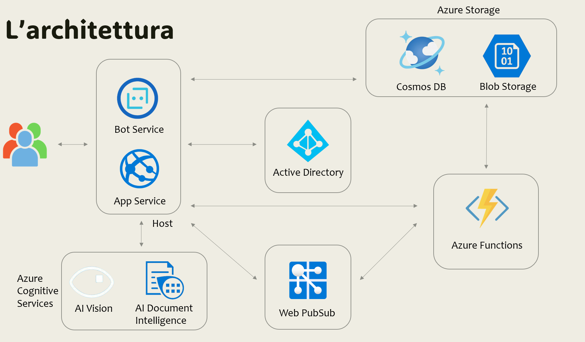

<div align="center">
  <h1>
    <br/>
    ☁️
    <br />
    act4you
    <br />
  </h1>
  <sup>
    <h3>
    Progetto del corso di Cloud Computing 2023/2024
    </h3>
    </em>
</sup>
</div>
Covino Francesco Pio - Russo Luca
---

## Panoramica del progetto
Act4You nasce come web application sviluppata in Angular per attori/attrici in cerca di ingaggio per film, serieTV, spot pubblicitari, opere teatrali. L’obiettivo è collegare i due mondi offrendo varie funzionalità agli utenti. Si tratta di una piattaforma collaborativa dove ogni utente può inserire i propri annunci e candidarsi a quelli degli altri.

## Feature principali
Act4You offre le seguenti funzionalità:
1. *Login e registrazione*: L’utente può registrarsi alla piattaforma attraverso il proprio account Microsoft, la gestione di account e credenziali viene svolta con Azure EntraID.
2. *Pubblicare un annuncio*: L’utente può pubblicare nuovi annunci sulla piattaforma specificando il tipo di lavoro e i vari dettagli.
3. *Candidarsi ad un annuncio*: L’utente può candidarsi agli annunci degli altri utenti caricando i propri file (foto, video, cv).
4. Notifiche annunci: L’utente riceve notifiche quando nuovi annunci vengono pubblicati sulla piattaforma
5. *Sezione QnA*: L’utente ha la possibilità di chattare, nel caso di dubbi sulla piattaforma o sul suo funzionamento, con un bot conversazionale nell’apposita sezione.
6. *Analisi foto e documenti*: L’utente può analizzare i pdf e le immagini dei candidati ai propri annunci utilizzando funzionalità di IA.
7. *Traduzione documenti*: L'utente può tradurre automaticamente i documenti in varie lingue.
## Architettura


## Servizi Azure
Act4You utilizza vari servizi di Microsoft Azure per implementare le funzionalità offerte, di seguito quelli utilizzati:
1. *Azure App Service*: hosting della web app
2. *Azure Bot Service*: sviluppo, testing e pubblicazione bot in Azure
  2.1 *Language Studio*: addestramento del bot 
4. *Azure Entra ID* (ex Azure Active Directory): gestione credenziali utente
5. *Azure CosmosDB*: persistenza dei dati relativi agli annunci
6. *Azure BlobStorage*: persistenza dei dati di grandi dimensioni relativi alle candidature
7. *Azure Function*: 
8. *Azure AI Vision*: 
9. *Azure AI Document Intelligence*: analisi (schemi, lingua, modalità, tabelle) di un documento tramite IA
10. *Azure AI Translator*: 

## Installazione e avvio 
Prerequisiti
- Una sottoscrizione attiva Microsoft Azure 
- Azure CLI
- Visual Studio Code
- Angular e Node.js

Effettuare il clone della repository GitHub e installare i pacchetti richiesti con il comando
```npm install```
Creare i vari servizi su Azure elencati sopra e modificare i valori delle key per l'accesso alle api nel file *enviroments/environments.ts*. 

Da terminale digitare `ng serve --open` per avviare l'applicazione web. In automatico verrà aperta la tab del browser o in alternativa l'url è `http://localhost:4200/`. L'app si ricarica automaticamente in caso di modifica ai source file.
